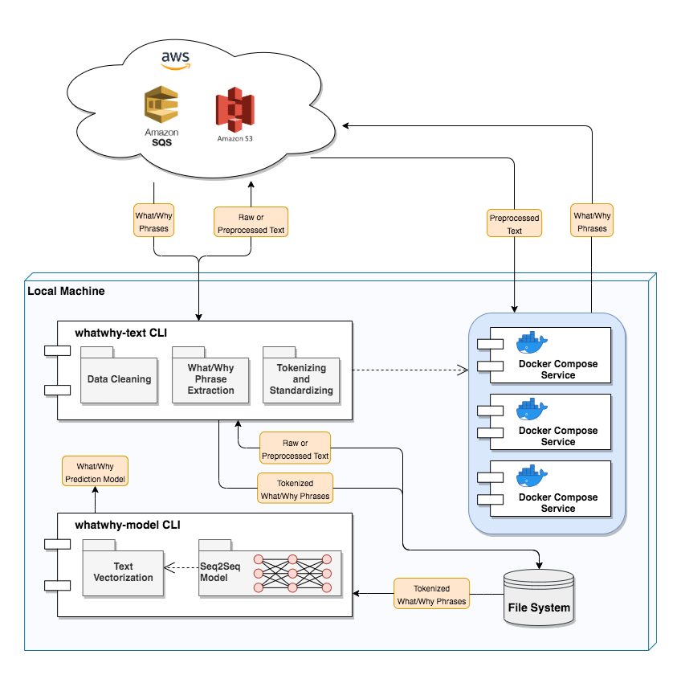

# What, why?

*WhatWhy* is a collection of scripts used to explore the relationships between
the *what* and the *why* of text passages – such as news articles – through the use
of [Sequence-to-Sequence](https://www.geeksforgeeks.org/seq2seq-model-in-machine-learning/)
models with a LSTM architecture. It can also be used for creating general models to
generate sequences of text.

This project offers both a Python library and a CLI to facilitate data preparation and
model training. *What* and *why* phrases are extracted using the tool
[Giveme5W1H](https://github.com/fhamborg/Giveme5W1H), and other tools are provided
to perform data processing tasks for improving model accuracy, such as:
- Preprocessing text to remove URL's and auto-correct misspelled words
- Tokenizing and standardizing text (e.g., [lemmatization](https://nlp.stanford.edu/IR-book/html/htmledition/stemming-and-lemmatization-1.html) and removing "stop words")
- Creating vector word embeddings and one-hot encodings



## Example

| Raw 'What' Input | Raw 'Why' Actual | 'Why' Predicted |
|:-----------------|:-----------------|:----------------|
| speedier delivery was not due to "any slowing of demand" but because the company | **company** has **increased** its **production** capacity | **good ceo production**             |
| may set different deposit reserve ratios and adopt more frequent use             | the People's **Bank of China** (PBOC)                     | agreed competition **foreign loan** |
| remains strong, although recent market turmoil                                   | **concerns** about slowing **economic** growth            | **fear** demand **economic**        |

See below for the full example.

## Installation

*WhatWhy* requires `Python3.6` and `swig3` to be installed (this is usually in your distro package manager).
If using the included Docker files to extract *what* and *why* phrases from text,
then `Docker` and `Docker Compose` are also required.

To install, simply clone the repository and install with `pip`:
```
git clone https://github.com/stevengt/whatwhy.git
cd whatwhy
pip install .
```

There may be temporary build errors from the external dependency `jamspell`, but these can be safely ignored.

## Usage

To prepare a CSV data set of text for use during model training, use the `whatwhy-text` CLI.

```
usage: whatwhy-text [-h]
                    (--populate | --process {preprocessing,wh-phrases,transfer,tokenize,tokenize-wh-phrases,consolidate})
                    -st {fs,s3,sqs} -sn SOURCE_NAME -dt {fs,s3,sqs} -dn
                    DEST_NAME [-d] [-bs BATCH_SIZE] [--aws-region AWS_REGION]
                    [--id-col ID_COL] [--source-col SOURCE_COL]
                    [--dest-col DEST_COL]
                    [--include-cols [INCLUDE_COLS [INCLUDE_COLS ...]]]

This is a CLI for batch processing text data. Specifically, it is used
to preprocess text, extract WH phrases (who, what, when, where, why, how),
and prepare the extracted phrases as text tokens for further analysis
with machine learning tools.

Data is assumed to be in CSV format. To split a single CSV
file into multiple batch files, use the --populate argument. 
Similarly, to consolidate batch files into a single CSV file,
use the argument '--process consolidate'.    

Data must be read from, and written to, one of these supported locations:
    - Local File System
    - Amazon S3
    - Amazon SQS

If using AWS, credentials should be stored in a format compatible with boto3,
such as environment variables or a credentials file. For more information, see:
https://boto3.amazonaws.com/v1/documentation/api/latest/guide/configuration.html

Supported batch processing tasks are:
    - consolidate   : Consolidates data from multiple CSV files into a single CSV file.
    - transfer      : Transfers a batch of data without changing its contents.
    - preprocessing : Preprocesses text by removing URL's and auto-correcting common spelling errors.
    - wh-phrases    : Extracts the WH phrases (who, what, when, where, why, how) from text.
                      This is intended to be run from within a Docker network, since access to
                      a Stanford CoreNLP server API at http://corenlp-service:9000 is required.
                      Please see the readme file at https://github.com/stevengt/whatwhy
                      for more information.
    - tokenize      : Tokenizes and standardizes text-segments.
    - tokenize-wh-phrases : This is identical to 'tokenize', except it tokenizes the 
                            columns 'who', 'what', 'when', 'where', 'why', 'how'
                            and stores the results in 'who tokens', 'what tokens', 
                            'when tokens', 'where tokens', 'why tokens', and 'how tokens'.

optional arguments:
  -h, --help            show this help message and exit
  --populate            Use this argument to split a single CSV file into multiple batch files. (default: False)
  --process {preprocessing,wh-phrases,transfer,tokenize,tokenize-wh-phrases,consolidate}
  -st {fs,s3,sqs}, --source-type {fs,s3,sqs}
  -sn SOURCE_NAME, --source-name SOURCE_NAME
                        If using S3, use the format bucket-name/folder/name. (default: None)
  -dt {fs,s3,sqs}, --dest-type {fs,s3,sqs}
  -dn DEST_NAME, --dest-name DEST_NAME
                        If using S3, use the format bucket-name/folder/name. (default: None)
  -d, --delete-when-complete
                        Optional flag to delete batches from the source after processing them. (default: False)
  -bs BATCH_SIZE, --batch-size BATCH_SIZE
                        The number of rows each CSV batch file should have if 
                        using the --populate flag. (default: 1000)
  --aws-region AWS_REGION
                        Name of AWS region, if using SQS. (default: us-east-1)
  --id-col ID_COL       Name of the column to treat as an index containing 
                        unique identifiers for data rows. (default: ID)
  --source-col SOURCE_COL
                        Name of the column to perform processing tasks on. (default: Preprocessed Text)
  --dest-col DEST_COL   Name of the column to store results in after processing data. (default: Processed Text)
  --include-cols [INCLUDE_COLS [INCLUDE_COLS ...]]
                        By default, only the ID and destination columns will be written to 
                        the destination. Use this argument to specify any additional columns 
                        to include. (default: None)
```

To extract the *what* and *why* phrases from text,
configure the following environment variables and run `make && make run-wh-phrase-extractor`
from the project root directory to build and run the included Docker files:
- `AWS_ACCESS_KEY_ID`
- `AWS_SECRET_ACCESS_KEY`
- `WHATWHY_SOURCE_TYPE`
- `WHATWHY_SOURCE_NAME`
- `WHATWHY_DEST_TYPE`
- `WHATWHY_DEST_NAME`
- `WHATWHY_ID_COL_NAME`
- `WHATWHY_SOURCE_COL_NAME`
- `WHATWHY_DOCKER_SERVICE_NAME` This is just an arbitrary identifier for the Docker service.

**Warning**: This will use about 4GB of RAM due to the
underlying [Stanford CoreNLP server](https://stanfordnlp.github.io/CoreNLP/corenlp-server.html).

To use the resulting set of prepared data to train and use a model, use the `whatwhy-model` CLI.

```
usage: whatwhy-model [-h]
                     (--train | --predict PREDICT [PREDICT ...] | --compare-test | --compare-train)
                     [-csv CSV_FILE_NAME]
                     [--min-token-frequency MIN_TOKEN_FREQUENCY]
                     [-min-tokens MIN_TOKENS_PER_SAMPLE]
                     [-max-tokens MAX_TOKENS_PER_SAMPLE] [-bs BATCH_SIZE]
                     [--epochs EPOCHS]

This is a CLI for training and using a model to predict sequences of 'why' text from input 'what' text.

This script uses the GoogleNews gensim Word2Vec model to embed
text tokens into 300-dimensional vectors. The first time the
script is run it may take some time to download this model.

Also note that this model is quite large (about 3.6 GB), and any
models created by this script can also potentially be large
depending on the size of the provided data set. If you are using
a Linux system with a small root partition, then you should install
this script in a Python distribution (e.g., Anaconda) that stores
files on a large enough disk.

optional arguments:
  -h, --help            show this help message and exit
  --train               Trains a prediction model using a supplied CSV file or previously loaded 
                        data set. This will overwrite any previously trained models. (default: False)
  --predict PREDICT [PREDICT ...]
                        Uses a previously trained model to predict a sequence of 'why' text 
                        from the input 'what' text. (default: None)
  --compare-test        Uses a previously trained model to compare its predictions 
                        against its testing data set. (default: False)
  --compare-train       Uses a previously trained model to compare its predictions 
                        against its training data set. (default: False)
  -csv CSV_FILE_NAME, --csv-file-name CSV_FILE_NAME
                        Name of a tab delimited local CSV file containing a data set for model training. 
                        If left blank, the most recently loaded data set will be used. 
                        CSV files must include columns labeled 'what tokens' and 'why tokens', 
                        each containing plain-text representations of a Python list of strings. (default: None)
  --min-token-frequency MIN_TOKEN_FREQUENCY
                        The minimum number of times a token should occur in the dataset 
                        to be used for training a WhatWhyPredictor model. (default: 30)
  -min-tokens MIN_TOKENS_PER_SAMPLE, --min-tokens-per-sample MIN_TOKENS_PER_SAMPLE
                        The minimum number of tokens a sample should contain to be used 
                        for training a WhatWhyPredictor model. (default: 4)
  -max-tokens MAX_TOKENS_PER_SAMPLE, --max-tokens-per-sample MAX_TOKENS_PER_SAMPLE
                        The maximum number of tokens a sample should contain for training 
                        a WhatWhyPredictor model. Any extra tokens will be truncated. (default: 10)
  -bs BATCH_SIZE, --batch-size BATCH_SIZE
                        Size of batches to use during model training. (default: 16)
  --epochs EPOCHS       Number of epochs used to train a model. (default: 10)
```

### Example Usage

Let's use the [Financial News Dataset from Reuters](https://github.com/duynht/financial-news-dataset).
To compile the data set into a single CSV file, we can use a modified version of
[these](https://github.com/Kriyszig/financial-news-data) scripts.

```python
import os
import csv
import pandas as pd

def should_skip_file_or_folder(name):
    return name.find(".tar") > -1 or name.find(".DS") > -1

dir_name = os.path.join(os.path.curdir, "ReutersNews106521")
df = pd.DataFrame(columns=["ID", "Content"])
contents = []

folder_names = os.listdir(dir_name)
for folder_name in folder_names:
    if should_skip_file_or_folder(folder_name):
        continue
    full_folder_name = os.path.join(dir_name, folder_name)
    file_names = os.listdir(full_folder_name)
    for file_name in file_names:
        if should_skip_file_or_folder(file_name):
            continue
        full_file_name = os.path.join(full_folder_name, file_name)
        with open(full_file_name, "r") as in_file:
            lines = in_file.readlines()[8:]
            content = " ".join(lines)
            contents.append(content)

contents_as_series = pd.Series(contents).dropna()
df["Content"] = contents_as_series
df["ID"] = df.index
df.to_csv('newspd.csv', sep="\t", quoting=csv.QUOTE_ALL, quotechar='"')
```

With the data saved in newspd.csv, we can split it into batch files
each containing 30 articles, preprocess the text, and then transfer the 
preprocessed batches to a SQS queue. In this case the queue is named
"whatwhy-phrase-extraction".

```
$ whatwhy-text --populate \
               --source-type fs \
               --source-name newspd.csv \
               --dest-type fs \
               --dest-name raw-batches \
               --batch-size 30

$ whatwhy-text --process preprocessing \
               --source-type fs \
               --source-name raw-batches \
               --dest-type sqs \
               --dest-name whatwhy-phrase-extraction \
               --source-col Content \
               --delete-when-complete
```

Now, we can build and run (from the project root directory)
the included Docker files to pull batches from SQS,
extract the *what* and *why* phrases, and store the results
in a S3 folder "whatwhy-data/news". To speed up processing,
we can run this script multiple times in parallel
(each with a different `WHATWHY_DOCKER_SERVICE_NAME`),
potentially on multiple machines. To stop the process,
enter `Ctrl+C`.

```
$ export AWS_ACCESS_KEY_ID=***** \
         AWS_SECRET_ACCESS_KEY=***** \
         WHATWHY_SOURCE_TYPE=sqs \
         WHATWHY_SOURCE_NAME=whatwhy-phrase-extraction \
         WHATWHY_DEST_TYPE=s3 \
         WHATWHY_DEST_NAME=whatwhy-data/news \
         WHATWHY_ID_COL_NAME=ID \
         WHATWHY_SOURCE_COL_NAME="Processed Text" \
         WHATWHY_DOCKER_SERVICE_NAME=whatwhy-docker-service-1
$ make && make run-wh-phrase-extractor
```

To prepare the extracted *what* and *why* phrases for model training
we pull the results from S3, split the phrases into lemmatized tokens,
and consolidate the data into a single CSV file consolidated_batches.csv .

```
$ whatwhy-text --process tokenize-wh-phrases \
               --source-type s3 \
               --source-name whatwhy-data/news \
               --dest-type fs \
               --dest-name tokens \
               --delete-when-complete

$ whatwhy-text --process consolidate \
               --source-type fs \
               --source-name tokens \
               --dest-type fs \
               --dest-name . \
               --delete-when-complete
```

Then, we train our model! Here, we constrain sequences to have 4-10
tokens, and each token must occur a mimimum of 30 times in the data set.

```
$ whatwhy-model --train \
                --csv-file-name consolidated_batches.csv \
                --min-token-frequency 30 \
                --min-tokens-per-sample 4 \
                --max-tokens-per-sample 10 \
                --batch-size 16 \
                --epochs 100

$ whatwhy-model --compare-test
```

Although the data is very noisy, some of the predictions from
the testing data set are pretty close (emphasis is added for illustration):

| Raw 'What' Input | Raw 'Why' Actual | 'Why' Predicted |
|:-----------------|:-----------------|:----------------|
| speedier delivery was not due to "any slowing of demand" but because the company | **company** has **increased** its **production** capacity | **good ceo production**             |
| may set different deposit reserve ratios and adopt more frequent use             | the People's **Bank of China** (PBOC)                     | agreed competition **foreign loan** |
| remains strong, although recent market turmoil                                   | **concerns** about slowing **economic** growth            | **fear** demand **economic**        |
 